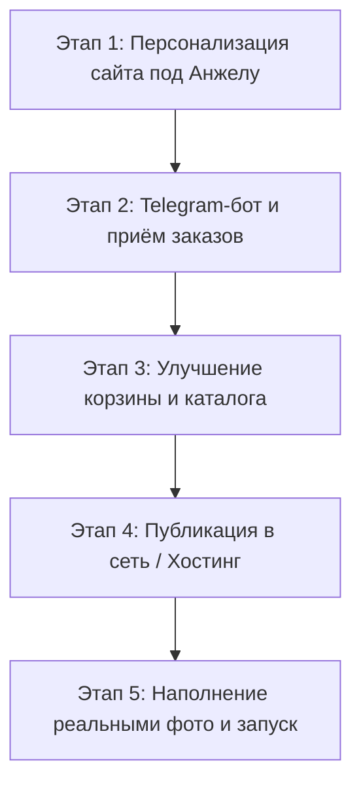

# 🗺️ Генеральный план: Сайт и система заказов для Анжелы Бачериковой

> **Проект:** LUMIÈRE atelier de bougies  
> **Мастер:** Бачерикова Анжела Александровна  
> **Город:** г. Киров  
> **Цель:** Запустить эстетичный, продающий сайт с каталогом свечей и изделий ручной работы с автоматическим приёмом заказов в Telegram.

---

## 💡 Ответ на главный вопрос по GitHub
**Можно ли запустить второй (и третий) сайт на одном аккаунте GitHub?**  
**ДА, АБСОЛЮТНО!**
* На аккаунте `marzettegeula-cyber` основной сайт имеет адрес `marzettegeula-cyber.github.io`.
* **Любой другой проект** запускается по адресу вида: `marzettegeula-cyber.github.io/anjela-candles`.
* Количество таких сайтов на GitHub **не ограничено** (можно иметь 10, 50 проектов). Они полностью изолированы и не влияют друг на друга.
* *Альтернатива:* Мы также можем выложить сайт на **Vercel** (`anjela-candles.vercel.app`) или **Netlify** — это тоже 100% бесплатно, даёт красивый поддомен и автоматически обновляется.

---

## 📋 Пошаговый план реализации



---

### Этап 1. Персонализация под Анжелу и г. Киров 🛠️
1. **Обновление информации о мастере:**
   - Заменить имя на **Анжела Бачерикова (Бачерикова Анжела Александровна)**.
   - Добавить блок об авторе: ручное создание в мастерской в г. Киров, философия медленного уюта и экологичности.
2. **Локация и условия доставки:**
   - Указать: **г. Киров** (самовывоз в Кирове, доставка на такси/курьером).
   - Доставка по всей России: СДЭК и Почта России.
   - Бесплатная доставка от 3 500 ₽.
3. **Контакты и соцсети:**
   - Подготовить поля для телефона Анжелы, ссылки на её Telegram, WhatsApp, группу VK или профиль.
4. **Расширение ассортимента:**
   - Кроме свечей добавить разделы:
     * *Аромадиффузоры для дома и авто*
     * *Гипсовые подносы и подсвечники*
     * *Подарочные крафтовые боксы*

---

### Этап 2. Архитектура приёма заказов через Telegram 🤖
Чтобы Анжела не упустила ни одной заявки, мы внедрим надежную систему:

1. **Telegram-бот уведомлений о заказах (основной канал):**
   - Создаём бота через `@BotFather` (например, `@LumiereKirovBot` или `@AngelaCandlesBot`).
   - Подключаем отправку заказов из формы сайта прямо в личный чат Анжелы или закрытую группу заказов.
   - **Формат уведомления, который мгновенно приходит Анжеле:**
     ```text
     🕯️ НОВЫЙ ЗАКАЗ С САЙТА #1024
     ━━━━━━━━━━━━━━━━━━━━
     👤 Клиент: Мария Иванова
     📞 Телефон: +7 (912) 345-67-89
     📍 Адрес: г. Киров, Октябрьский пр-т, 24
     🚚 Доставка: Курьер по Кирову / СДЭК
     💌 Пожелание: «Положите, пожалуйста, открытку с днем рождения»
     ━━━━━━━━━━━━━━━━━━━━
     📦 Состав заказа:
     1. Свеча «Кашемир & Ваниль» (200 мл) — 1 шт. × 1 490 ₽
     2. Подставка из гипса «Овал» — 1 шт. × 450 ₽
     ━━━━━━━━━━━━━━━━━━━━
     💰 Итого к оплате: 1 940 ₽
     ```
2. **Кнопка быстрой связи в мессенджеры (запасной канал):**
   - Кнопки «Написать в WhatsApp» и «Написать в Telegram» с автоматически сформированным текстом заказа для быстрой консультации в 1 клик.

---

### Этап 3. Улучшение каталога и функционала сайта 🛒
1. **Память корзины (`localStorage`):**
   - Если посетитель случайно закрыл страницу или обновил браузер, товары останутся в корзине.
2. **Выбор формата/объёма свечи в карточке товара:**
   - Возможность выбрать: `100 мл` / `200 мл` / `В гипсовом кашпо` (с авто-пересчетом цены).
3. **Карточки изделий ручной работы:**
   - Добавить в каталог подсвечники, подставки из высокопрочного скульптурного гипса, диффузоры.
4. **Удобный выбор доставки в Кирове:**
   - Быстрый выбор: «Самовывоз в Кирове (Бесплатно)», «Курьер / Яндекс Доставка по Кирову», «СДЭК по России».

---

### Этап 4. Публикация сайта в интернет 🌐
1. **Вариант А — GitHub Pages на твоём аккаунте:**
   - Создаём репозиторий `anjela-candles` под твоим профилем `marzettegeula-cyber`.
   - Пушим файлы одной командой.
   - Включаем Pages -> сайт сразу доступен по адресу `https://marzettegeula-cyber.github.io/anjela-candles/`.
2. **Вариант Б — Vercel / Netlify:**
   - Бесплатное мгновенное развёртывание с красивым адресом (например, `lumiere-kirov.vercel.app`).
   - Можно привязать свой домен (например, `lumiere-candles.ru`), если захотите в будущем.

---

### Этап 5. Наполнение реальным контентом и сдача 📸
1. Замена временных фотографий на реальные фото свечей и изделий Анжелы.
2. Тестовый прогон: оформление заказа и проверка прихода уведомления в Telegram.
3. Инструкция для Анжелы по управлению заказами.
